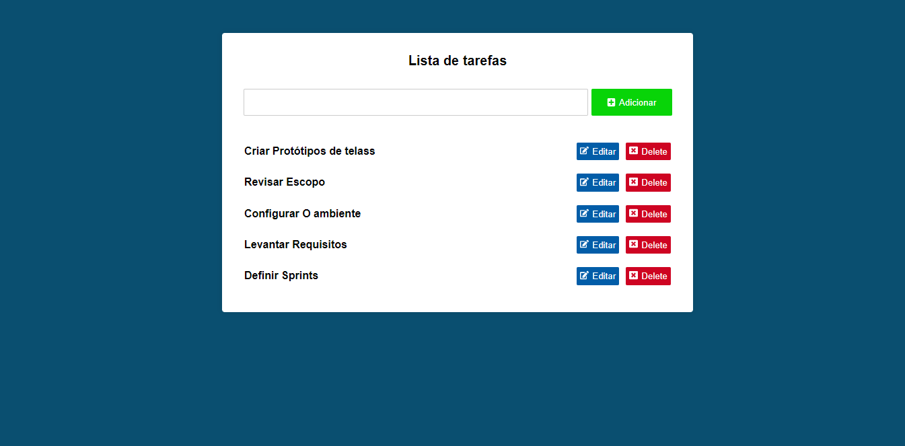

<h3 align="center">
    <br><br>
    <b>ToDotarefas</b>
    <br>
    <br>
</h3>


<p align="center">
  <a href="#sobre">Projeto</a>&nbsp;&nbsp;&nbsp;|&nbsp;&nbsp;&nbsp;
  <a href="#tecnologias-utilizadas">Tecnologias</a>&nbsp;&nbsp;&nbsp;|&nbsp;&nbsp;&nbsp;
  <a href="#como-usar">Como Usar</a>&nbsp;&nbsp;&nbsp;|&nbsp;&nbsp;&nbsp;
  <a href="#Como-Contribuir">Como Contribuir</a>
</p>

<p align="center">
 

  
</p>

<br>


<a id="sobre"></a>


## :bookmark: Sobre

O <strong>ToDoTarefas </strong> é uma aplicação Web criada com react, onde tem todas as funcionalidad do Crud, utilizan o localstorange para pesistir os dados.


<a id="tecnologias-utilizadas"></a>

## :rocket: Tecnologias Utilizadas

O projeto foi desenvolvido utilizando as seguintes tecnologias

- [React]


<br>

## :heavy_check_mark: :computer: Resultado Web

<h1 align="center">
    

</h1>

<a id="como-usar"></a>

## :fire: Como usar

- ### **Pré-requisitos**

  - É **necessário** possuir o  **[Node]()** instalado na máquina


1. Faça um clone :

```sh
  git clone https://github.com/Rafael-Rufino/ToDotarefas.git
```

2. Executando a Aplicação:

```sh

# Install dependecias
  $ npm install
  #ou
  $ yarn install

  # Inicie a aplicação web
  $ cd ToDotarefas
  $ npm start


  # Acessar o Servidor no Navegador
  $ http://127.0.0.1:3000/


```

<a id="Como-Contribuir"></a>


## :recycle: Como contribuir

- Faça um Fork desse repositório,
- Crie uma branch com a sua feature: `git checkout -b my-feature`
- Commit suas mudanças: `git commit -m 'feat: My new feature'`
- Push a sua branch: `git push origin my-feature`


🎓 **Quem ministrou?**

As aulas foram ministradas pelo mestre Otavio oliveira

📝 **License**

Esse projeto está sob a licença MIT. Veja o arquivo [LICENSE](LICENSE.md) para mais detalhes.


<h4 align="center">
    Feito com 💜 by <a href="https://www.linkedin.com/in/rafael-r-dos-santos-b889311ba/" target="_blank">Rafael Rufino</a>
</h4>


